# Industry-Classification
The goal of this project is to use NLP techniques to classify companies according to their descriptions. Descriptions used in this project are from yahoo finance and EDGAR 10-K reports.


## Usage

1. Extract 10_K reports
	* Clone [SEC-EDGAR-text](https://github.com/alions7000/SEC-EDGAR-text) project
	* Modify **document_group_section_search.json** file to only include Section 1A parts of 10-K filings (simply delete all other parts of JSON file)
	* Run program using:
	
		```
	    python SEC-EDGAR-text
		```

		* With the default settings (extract reports from 20190930 to 20200929), this outputs 10K filings of SnP500 companies. Filter from output (from 'output_files_examples/batch_xx/' folder) all filenames ending with `excerpt.txt`) and transfer all these .txt files into `data_out/10-K/SnP` folder in this project.
		* To get 10K reports of companies in Russell 3000 index, run code section in **Data Extraction.ipynb** under header *List of CIKs for relevant tickers*, copy output (data_out/scrapping_ticker_ciks.txt) to companies_list.txt file in SEC-EDGAR-text project, and run it. Transfer filtered output to a new folder (e.g. `data_out/10-K/Russell`)

1. Run **Data Extraction.ipynb**. This populates `data_out/` folder  with:
	*  data scraped from [Yahoo Finance](https://sg.finance.yahoo.com/) (Note: `yahoo_spiders/data_in/` folder is also polulated with Ticker symbol data in this step)
	*  data merging all .txt files which were copied in previous step
	*  clean data from ticker to gics mapping

1. In `yahoo_spiders/` folder, run **yahoo_spiders** with:
	
	```
    scrapy crawl yahoo_desc
    scrapy crawl yahoo_price
    scrapy crawl yahoo_ratios
    ```

	* This populates `yahoo_spiders/data_out/` folder with data scraped from Yahoo Finance as well
	* If .csv file you are writing to exists, delete before re-running (as Scrapy appends to files instead of overwriting)
	* Edit  `INDEX` parameter each spider accordingly to scrape data from respective index (e.g. snp, russell)
    
1. Run **LSI Word Embedding.ipynb**

	* Set `desc_df` parameter (under *Global Vars* header) according to which index tickers results are required for.


## Results

### 1. Average R2 
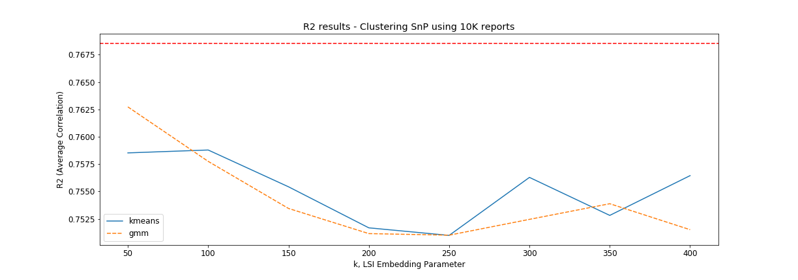
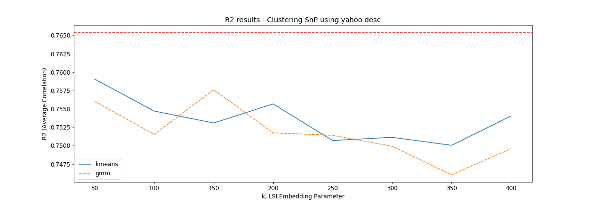
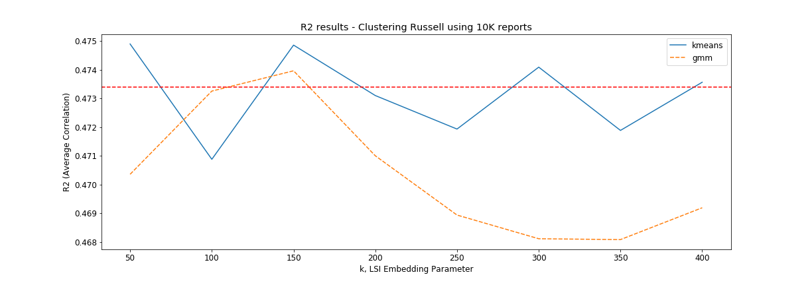
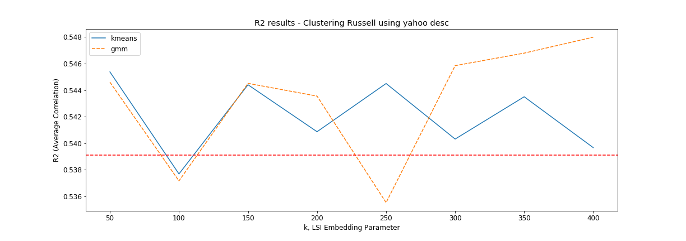

* For SnP, lower k values seem to perform better
* No significant difference between K-means and GMM
* Using yahoo desc seems to give slightly better results (for both snp and russell)

### 2. Inter Industry Variation
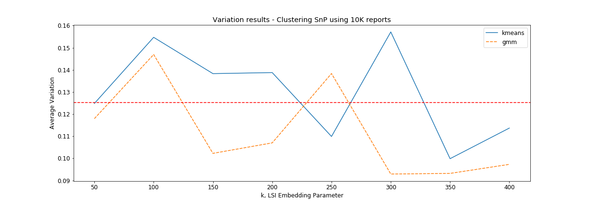
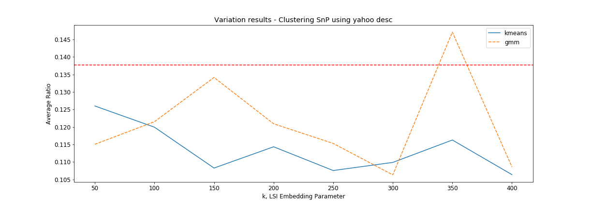
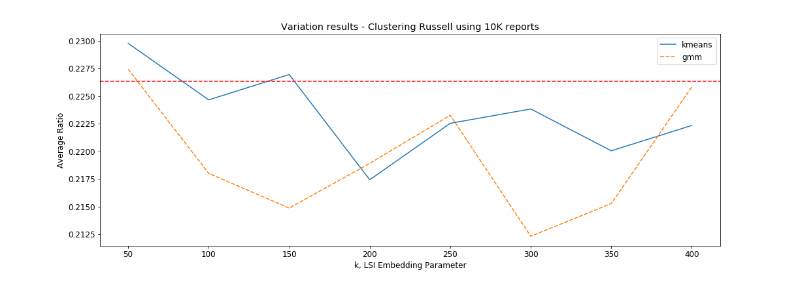
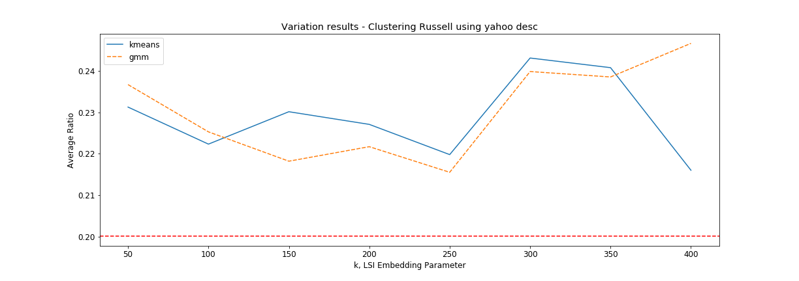

* no consulsive results

### 3. Similarity Probability with GICS
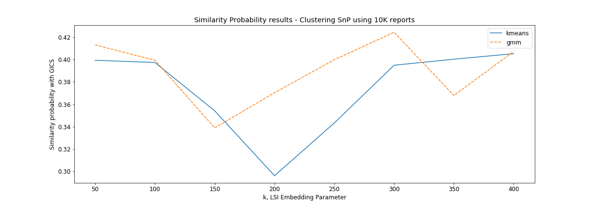
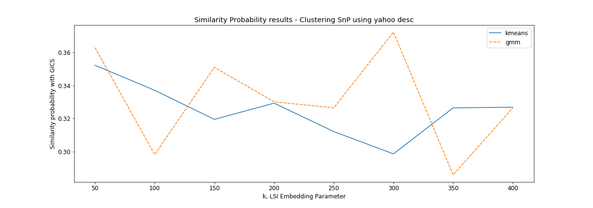
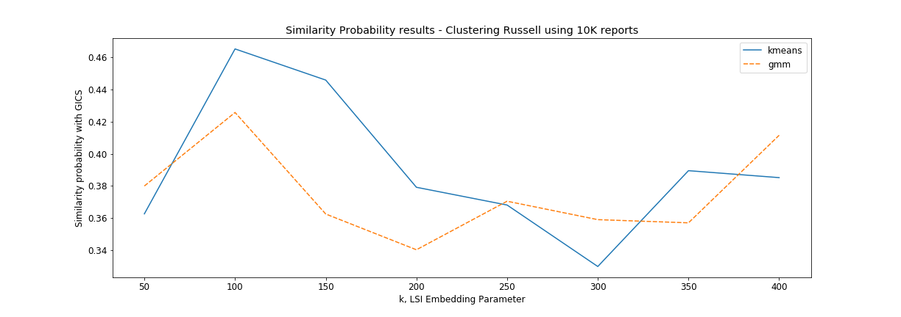
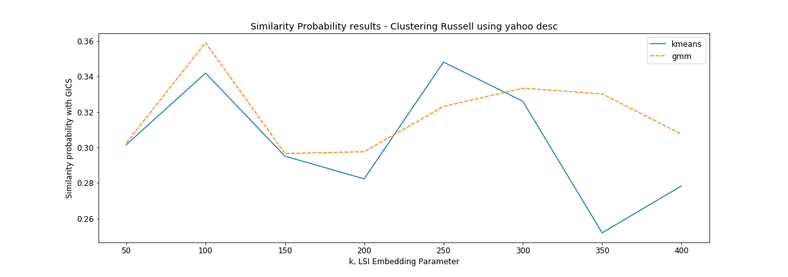

* clustering with 10K reports gives closer classification to GICS


* Reasoning behind results

## Data Description and Sources (in `data_in/` folder or APIs used or websites scraped)

* API for CIK to ticker mapping
	* https://medium.com/@jan_5421/cik-to-ticker-mapping-bb22194b5cc0
* cik_ticker.csv
	* not sure, not used
* russell_price.csv
	* price of all tickers in Russell 3000 index from Jan 2015 to May 2020 (from past project)
* russell_ratio.csv
	* 6 ratios (mkt_cap, pb_ratio, beta, profit_m, roa, roe) of all Russell 3000 index companies
	* from past project)
* Russell3000.pdf
	* list of all comanies in Russell 3000, updated 31 Mar 2020, however ticker name not provided
	* from [FTSE Russell](https://www.ftserussell.com/analytics/factsheets/home/constituentsweights)
* list Russell 3000 tickers
	* from 3rd party source but claims last updated on 21 Sep 2020
	* http://www.kibot.com/Historical_Data/Russell_3000_Historical_Intraday_Data.aspx
* list of STI tickers
	* https://en.wikipedia.org/wiki/Straits_Times_Index
* list of SnP tickers
	* http://en.wikipedia.org/wiki/List_of_S%26P_500_companies
* ticker_to_gics.csv
	* mapping for all tickers in Russell 3000
	* from prof (also found in past project)
* GICS classification of SnP stocks 
	* from bloomberg
	* from prof
* Stop Words List (for financial use)
	* https://sraf.nd.edu/textual-analysis/resources/#StopWords
