# Text-based Industry Classification
The goal of this project is to use NLP techniques to classify companies according to their descriptions and compare it with the current industry standard, Global Industry Classification Standard (GICS). The SnP500 and Russell 3000 Indexes are specifically studied in this project. Several Sources of description, topic modelling techniques, clustering techniques are used as listed:

* Descriptions used:
	1. EDGAR 10-K reports
	1. Yahoo Finance
	1. Wikipedia
	1. Morning Star
	1. Reuters
	1. Reuters India
	1. Bloomberg
* Topic Modelling Techniques:
	1. Latent Semantic Indexing (LSI)
	1. LatentDirichletAllocation (LDA)
	1. Non Negative Matrix Factorization (NMF)
	1. Principal Component Analysis (PCA)
* Clustering Techniques
	1. K-means
	1. K-medioids
	1. Gaussian Mixture Model
	1. Hierarchical Clustering


## Usage

### Viewing/Running Text-based Industry Classification
	
1. Install requirements for project using:

	```
	pip install -r requirements.txt
	```

2. Refer to **LSI Word Embedding.ipynb**
	* Adjust variables under *Global Vars* section to preference
	* Some data is not available on github as files are too big (eg. 10K reports and other business descriptions) but the method to retrive them is detailed below

### Data Extraction and Cleaning

This section shows how to extract and clean data which was used for this project.
* 1-4 : Data to extract which is not included
* 5,6 : Not necessary
* 7 : Data is included 

1. Extract Index Tickers
	* Refer to **Data Extraction and Cleaning.ipynb** under header *Scrape Index Tickers*
	* This set of tickers will be used when scraping business descriptions from the various sources

1. Extract 10-K Reports
	* Clone [SEC-EDGAR-text](https://github.com/alions7000/SEC-EDGAR-text) project
	* Modify **document_group_section_search.json** file to only include Section 1A parts of 10-K filings (simply delete all other parts of JSON file)
	* Run program using:
	
		```
	    python SEC-EDGAR-text
		```

		* With default settings, this outputs 10K filings of SnP500 companies from current date to one year prior. Filter from output (from 'output_files_examples/batch_xx/' folder) all filenames ending with `excerpt.txt` (using OS search functionality)(should be slightly less than half the total files) and transfer all these .txt files into `data_out/10-K/XX` folder in this project
		* Start and end date can be adjusted when program is run (as done in this project for 2015 and 2020 reports)
		* For this project, reports are scraped for a 1 year timeframe (to get data from as many companies as possible) and then filter the latest filing for each company 
		* Note that SnP500 ticker list used by the project can be outdated, so follow this procedure to extract data for a specific set of tickers (i.e. latest set of Russell Tickers):
			* Run code section in **Data Extraction and Cleaning.ipynb** under header *Scrape Ticker CIKs*, copy output (`data_out/scrapping_ticker_ciks.txt`) to companies_list.txt file in SEC-EDGAR-text project, and run it. Transfer filtered output to a new folder (e.g. `data_out/10-K/Russell/`)
		* Takes ~ 8hrs to run for Russell tickers
	* After `data_out/10-K/(index_name)/` folder has been populated, run code section in **Data Extraction and Cleaning.ipynb** under header *Merge 10K reports* (setting input and output folder and files accordingly)

1. Scrape Business Descriptions from multiple web-sources

	* Scrapy Framework used due to its much faster performance than other scraping tools (like selenium)
	* Business Description Sources:
		* Yahoo Finance
		* Business Insider
		* Morning Star
		* Reuters
		* Reuters India
		* Bloomberg
	* Ensure that you have saved the required index tickers into  `scrapy_spiders/data_in/` folder by following step 1
	* `cd` to  `scrapy_spiders/` folder and run spider for required data source with:
	
		```
	    scrapy crawl XXX_desc
	    ```
	 where XXX is either yahoo, businessinsider, morningstar, reuters, reutersindia or csimarket

	* This populates `scrapy_spiders/data_out/` folder with a .csv file of scraped descriptions
	* If .csv file you are writing to exists, delete before re-running (as Scrapy appends to files instead of overwriting if the file to write to exists)
	* Edit  `INDEX` parameter each spider accordingly to scrape data from respective index (e.g. snp, russell)
	* Note that xpaths of descriptions and other scraping information change frequently (due to change in format of website of the scraping site), so do ensure that you are retrieving the right information, else edit scrapy script accordingly (usually just need to change xpath)
	* Also, although spiders are saved in directory `scrapy_spiders/yahoo_spiders/` the yahoo_spiders does not mean only yahoo_spiders are in the directory (directory name is left unchanged as it was initialted as such and is difficult to rename now)

1. Extract Wikipedia Data
	* Refer to **Data Extraction and Cleaning.ipynb** under header *Scrape Wikipedia description*

1. Extract [Yahoo Finance](https://sg.finance.yahoo.com/) Descriptions (Method 2)
	* Refer to **Data Extraction and Cleaning.ipynb** under header *Scrape Yahoo Description, Price, Ratios*
	* This script mainly uses selenium and thus takes a long time, so it is better to use the scrapy framework
	* Download chromedriver.exe [here](https://chromedriver.chromium.org/downloads) and put driver in main folder
	* Extracts Business Descriptions from Yahoo Finance using Selenium Framework and yfinance module

1. Scrape Yahoo Prices and Market Ratios
	* Similar to above procedure, but with the commands:

		```
	    scrapy crawl yahoo_price
	    scrapy crawl yahoo_ratios
	    ```

	* This method is better than scrapy method as we are able to adjust start_date and end_date to longer periods (thanks to seleniums interactivity)

1. Other Data Extraction and Cleaning processes (Refer to **Data Extraction and Cleaning.ipynb** for details)
	* Scrape GICS industry code to name map
	* Clean Ticker to GICS map
	* Clean Market Ratios

## Results

### Main Results

1. Text-based Industry Classification has comparable performance to standard GICS Industry classification
	* Training on Russell 3000 stock business descriptions, best model performs 0.8% better than GICS R2 score (0.305) (Fig 1)
	* Even though it may not be significant, we know that it at least is perform as good as GICS classification, since model is able to cosistently able to perform in a +-1% range of the GICS R2 score for topic sizes from 100-250 (Fig 1)
	* Also, Ratio Variation (RV) scores are better in the ratios profit margin, ROA and ROE, but slightly worse in pb_ratio and beta. But all percentage differences are in a band of 10%, and we can conclude that Text-based Industry Classification is able to perform as well as GICS (Fig 2)

	|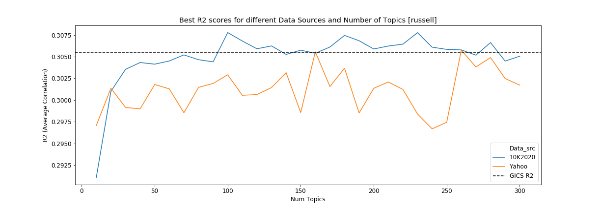|
	|:--:|
	| *Figure 1* |

	|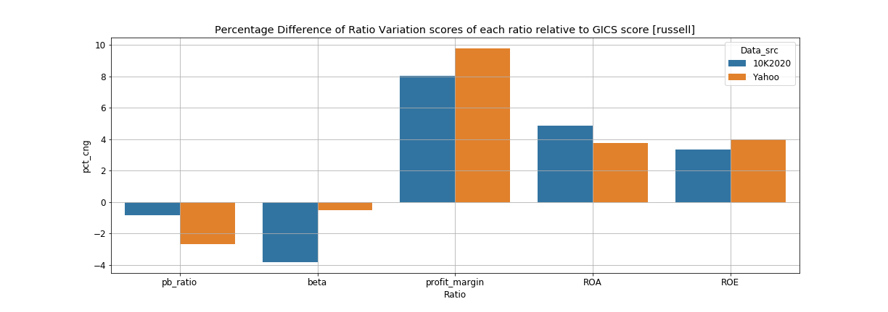|
	|:--:|
	| *Figure 2* |

1. Text-based Industry Classification performs better for lower market-cap stocks compared to high market-cap stocks relative to GICS Industry classification
	* When filtering classification of Russell 3000 stocks to 2 sections: SnP500 stocks (approximately top 500 capitalisation stocks) and Russell2 stocks (which we difine as the bottom 500 market capitalisation stocks in Russell 3000), and evluating we get the following results
		* Note: we dont train on sub-universe index individually to reduce bias
	* For SnP500, best model performs 1.5% better than the GICS R2 score (0.449) (Fig 3)
	* For Russell2, best model performs 4.0% better than the GICS R2 score (0.131) (Fig 5)
	* In terms of RV score, the percentage change relative to GICS score for all ratios are in a margin of 5% within each other for both Snp and Russell2 (Fig 4&6)
	* Given that the R2 is a stronger metric of industry classification, we conclude that text-based industry classification performs better for lower market-cap stocks compared to high market-cap stocks relative to GICS Industry classification
	* This may be due to classification of smaller companies not being updated frequently

	|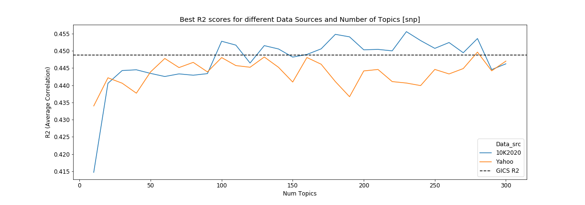|
	|:--:|
	| *Figure 3* |

	|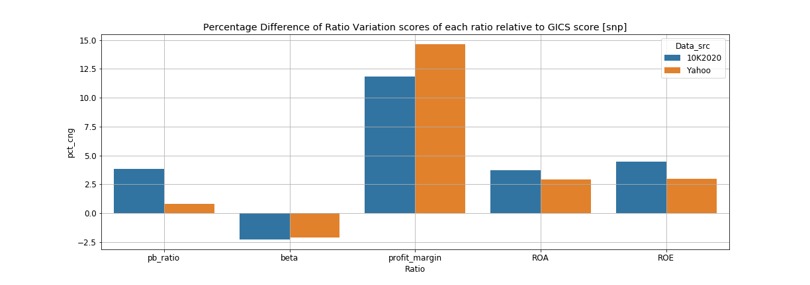|
	|:--:|
	| *Figure 4* |

	|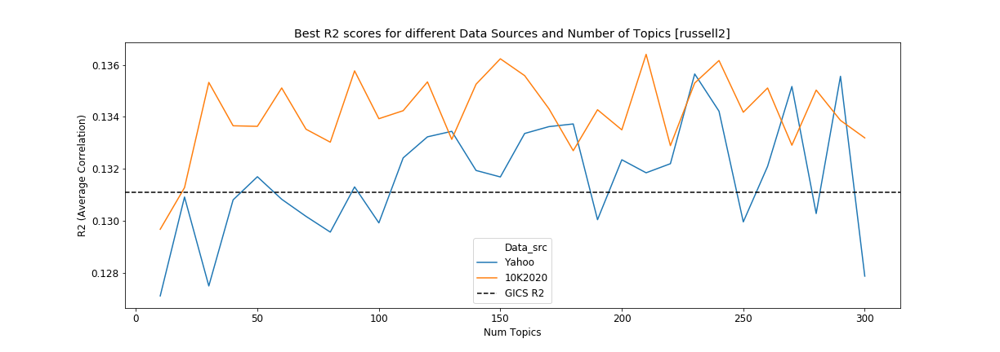|
	|:--:|
	| *Figure 5* |

	|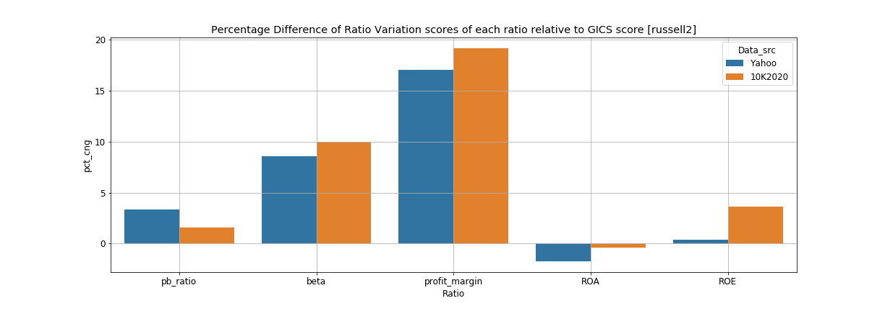|
	|:--:|
	| *Figure 6* |

1. Similarity of Text-based Industry Classification to GICS
	* Generally the similarity to GICS is about 50% (Fig 9)
	* Fig 7 shows the Similarity probability of each GICS industry to the classification model with best R2 score output trained on the Russell 3000 tickers
	* We see that Utilities generally are able to be classified well

	|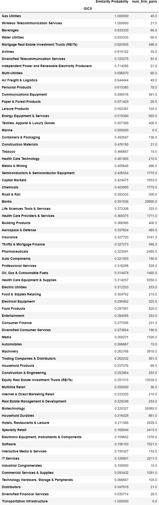|
	|:--:|
	| *Figure 7* |

### Minor Results

1. Data Sources which are most informative about classification based on the order of R2 metrics are (Fig 8):
	1. 10-K report Business Description
	1. Reuters India
	1. Yahoo (worst wiki)
	* Its noteworthy that 10-K reports from 2015 and 2020 dont show a significant different in R2 scores

	|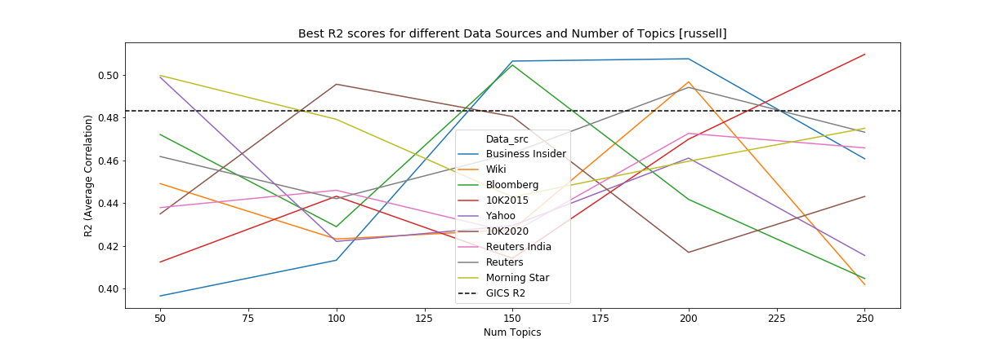|
	|:--:|
	| *Figure 8 : Run again...maybe cos unnormlalised?* |

1. For more general classifications, Text-based Industry Classification performs worse than the GICS standard
	* For Russell 3000 with sector classification, best model performs 2.22% worse than GICS Sector R2 (0.266) (Fig 9)

	|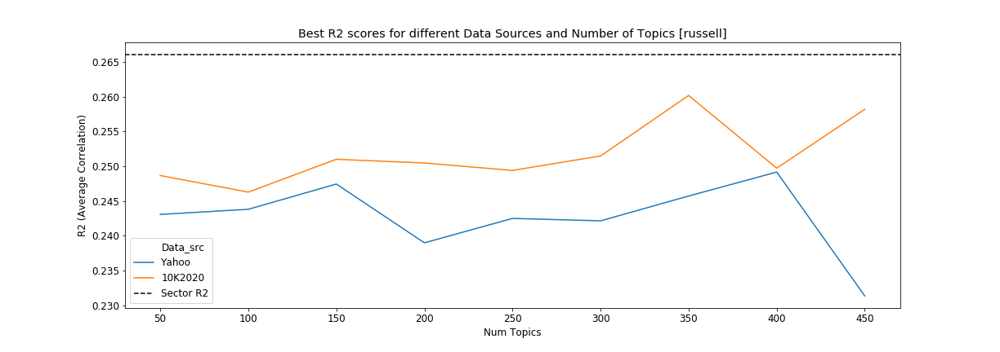|
	|:--:|
	| *Figure 9: Russell Classification by Sector* |

1. Topic modelling
	* LSI and PCA are the techniques which produce better R2 performance compared to NMF and LDA (Fig 10)
	* Usually num_topics in range [50,200] gives best R2 results (Fig 10)
	* Interestingly, LDA classifications are more similar to GICS, although it performs the worse in terms in R2 (Fig 11)
	
	|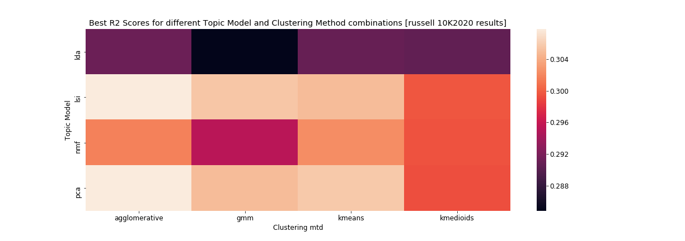|
	|:--:| 
	| *Figure 10* |

	|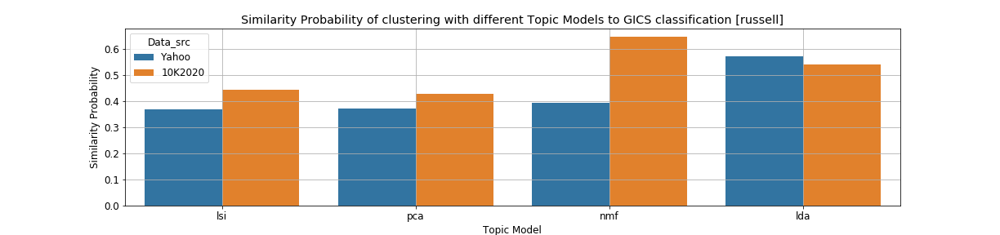|
	|:--:|
	| *Figure 11* |

1. Clustering Algo
	* Agglomerative Clustering seems to constantly perform well, followed by K-means and GMM (Fig 10)
	* K-Medioids consistantly does not perform well (Fig 10)


1. Pre-processing
	* Normalising (samplewise L2 scaling) or using the raw DTM after topic modelling dosent cause a significat difference in R2 scores
		* Best model for Russell was 0.29% and 0.80% better than GICS respectively
	* Standardizing is gives poor results
		* Best model for Russell was 0.21% worse than GICS

## Data used and Sources (in `data_in/` folder or APIs used or websites scraped)

* Company Business Description Data (MSFT is used as example in all the links)
	* [Yahoo](https://sg.finance.yahoo.com/quote/MSFT/profile?p=MSFT)
	* [Business Insider](https://markets.businessinsider.com/stocks/msft-stock)
	* [CNN](https://money.cnn.com/quote/profile/profile.html?symb=MSFT)
		* Same description as Business Insider
	* [Morning Star](https://www.morningstar.com/stocks/xnas/msft/quote)
	* [Reuters](https://www.reuters.com/companies/MSFT.O)
	* [Investing.com](https://www.investing.com/equities/microsoft-corp-company-profile)
		* Same description as Reuters
	* [Reuters India](https://in.reuters.com/finance/stocks/company-profile/MSFT.DF)
		* Medium length descriptions
	* [CSIMarket.com](https://csimarket.com/stocks/amzn-Business-Description.html)
		* Descriptions used are probably from 10K report
		* About 30% tickers do not have business description
	* [Bloomberg](https://www.bloomberg.com/profile/company/MSFT:US)
		* Unable to scrape as it has captcha
* russell_price.csv
	* price of all tickers in Russell 3000 index from Jan 2015 to May 2020 (from past project)
* russell_ratio.csv
	* 6 ratios (mkt_cap, pb_ratio, beta, profit_m, roa, roe) of all Russell 3000 index companies
	* from past project
* Russell3000.pdf
	* list of all comanies in Russell 3000, updated 31 Mar 2020, however ticker name not provided
	* from [FTSE Russell](https://www.ftserussell.com/analytics/factsheets/home/constituentsweights)
* list Russell 3000 tickers
	* from 3rd party source but claims last updated on 21 Sep 2020
	* http://www.kibot.com/Historical_Data/Russell_3000_Historical_Intraday_Data.aspx
* list of STI tickers
	* https://en.wikipedia.org/wiki/Straits_Times_Index
* list of SnP tickers
	* http://en.wikipedia.org/wiki/List_of_S%26P_500_companies
* Ticker-CIK map
	* https://www.sec.gov/include/ticker.txt
* ticker_to_gics.csv
	* ticker-GICS map for all tickers in Russell 3000
	* from prof (also found in past project)
* GICS classification of SnP stocks 
	* from bloomberg
	* from prof
* Stop Words List (for financial use)
	* https://sraf.nd.edu/textual-analysis/resources/#StopWords

Not used but explored
* API for CIK to ticker mapping
	* https://medium.com/@jan_5421/cik-to-ticker-mapping-bb22194b5cc0
* cik_ticker.csv
	* cik-ticker map for 13000+ tickers